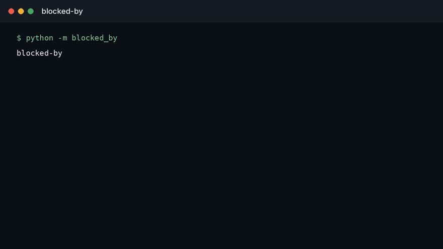

# blocked-by

**Which single rule kept this patient out of the trial — and was that rule doing safety work?**

**Status:** problem brief. The question and the measurement are written here. An implementation is not in this repository yet.

---

## Watch

  

The clip plays on this page. [Full video](docs/demo.mp4).

## The problem

Eligibility criteria are applied as a stack of ANDs. A patient can meet the disease, the age band, and the consent window, and still be out because one lab cutoff, one prior-therapy line, or one vague "investigator discretion" sentence fired.

Protocols rarely say which criterion did the excluding. They also rarely say whether that criterion is a safety bound or a copy-paste from the last study that made recruitment easier. Two patients with the same chart can be excluded for different sentences, and the screen-fail log just says "ineligible."

That hides the criterion a protocol could relax without touching patient safety, and it hides the criterion that must not move.

## The measurement I would trust

For one patient and one protocol, the useful output is not a yes/no.

| Output | What it has to show |
| --- | --- |
| Firing criterion | The single clause that fails, quoted from the protocol |
| Near misses | Clauses the patient passes with little margin |
| Safety vs convenience | Whether the firing clause is a known harm bound or an uncited restriction |
| What would flip it | The smallest change in a lab, a washout, or the clause itself |

A screen-fail count with no clause is not this measurement. A model score with no quoted sentence is not this measurement.

## What this repository is

A public statement of that measurement, next to the trial-reporting work in [silent-trials](https://github.com/TechieGoku2623/silent-trials). It is not a screening engine, not an eligibility decision, and not medical advice.

## Author

**Choppa Devasai Pranatheswar** · [LinkedIn](https://www.linkedin.com/in/devasai-pranatheswar)
